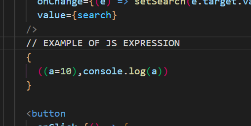

# 😛 Lecture 06

**React Fiber**: it's a new Reconciliation algorithm. you can read more about it here:&#x20;


[https://blog.openreplay.com/react-fiber-explained/](https://blog.openreplay.com/react-fiber-explained/)


**Diff Algo:**  Diff algorithm continuously compares your older DOM elements or node with the new DOM whenever something changes in some state variable or props and updates the actual DOM.

**Reconciliation Algorithm:** Diff algo is a part of reconciliation algo. it compares your virtual DOM with the actual DOM with the help of Diff algo and updates the actual DOM.


React is fast because of its faster DOM manipulation (Diff algo).



React only tracks **state variables** not **normal variables** for DOM manipulation.


**Statement VS Expression:**&#x20;

You can write any javascript code between your JSX code but it must be Expression, React doesn't support statements between JSX elements. eg:&#x20;

&#x20;

To read about it more you can read this article.


[https://beta.reactjs.org/learn/javascript-in-jsx-with-curly-braces](https://beta.reactjs.org/learn/javascript-in-jsx-with-curly-braces)


## **Assignment Questions:**

1.  **What are MicroServices?**

    MicroServies are small services that add up to make a big service, benefit of it is that every service is independent and they do not get affected by the performance of other services.
2.  **What is Monolith architecture?**

    Monolith architecture is when your whole application is running on a single service.
3.  **Why do we need useEffect Hook?**

    useEffect Hook was the replacement for ComponetDidUpdate.It's usually used to track the variable data and update it according to it.
4.  **What is Optional Chaining?**

    Optional chaining is when you put "?" in multiple parent-child objects to handle undefined conditions to save your UI o break.
5.  **What is Shimmer UI?**

    Shimmer is the UI that is shown before loading your real data.
6.  **What is the difference between JSX expression and JSX statement?**

    You can only write expressions between JSX, JSX doesn't support statement between it.
7.  **What is Condition rendering?**

    when which component will get rendered is decided based on some condition. this phenomenon is called Condition rendering.
8.  **What is CORS?**

    CORS is for network security, it gives your local to access the server from your local host.
9.  **What are Async and await?**

    It's a way to make synchronous code asynchronous.
10. **What is the data.json() method?**

    It is used to convert readable binary code to JSON format code.

