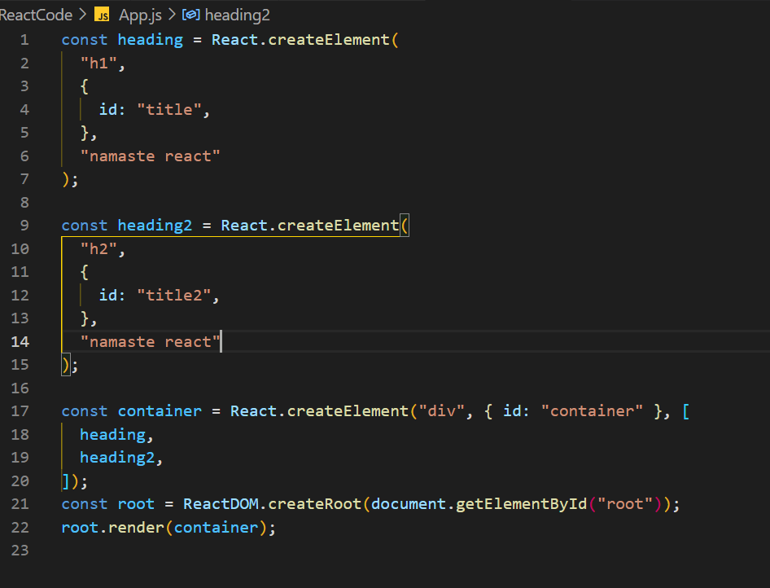

# 😀 Lecture First: Inception

#### First program:&#x20;

In this program, we just created a simple program with the use of CDN link so that we can connect with React.

<figure><figcaption>
First Program
</figcaption></figure>

#### CDN Links:

Following are the CDN links

Ref url: [https://reactjs.org/docs/cdn-links.html](https://reactjs.org/docs/cdn-links.html)

<figure><figcaption>
Use of CDN Links
</figcaption></figure>

#### App.js Code:

This is how we created our first code with two headings inside a div element

<figure><figcaption></figcaption></figure>

#### Homework with solutions:

[What is CDN](what-is-cdn.md)

[what is cross-origin](what-is-cross-origin.md)

[what is async and d](what-is-async-defer.md)[efer](what-is-async-defer.md)

