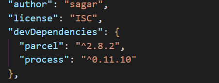

# 😎 Lecture Second: Igniting App

**Bundler**: bundlers are the file managers which give different functionalities to our project. eg. parcel and webpack

**^ and \~:**&#x20;

* Carrot(^) we use it in package.json when we want to upgrade the dependency for minor version and major in case of tilt (\~).
* Dependencies are always updated in package-lock.json, which stores the main versions of project dependencies

<figure><figcaption>
Tilt example
</figcaption></figure>

> #### We use react as a package instead of CDN beacause we want to create server on our local.

****

**npm**:  it's a package manager

**NPX:**   it means to execute with npm&#x20;

> #### npx parcel index.html

### **Bundler Functionalities**:

**Hot module reloading** -> it's a functionality of parcel your project auto-reload when you save.

**file-watcher-Algo** -> it's written in C++, it watches the file if anything has changed in the file or not and tells the server to reload

**parcel-cache**-> parcel uses it as storage and uses it to execute its functionalities.

**Dist folder** -> it stores the minified version of your product which is production ready.

<figure><figcaption>
Parcel.cache and dist folder
</figcaption></figure>

**transitive dependency** -> dependencies that are used by our package.json dependencies.

<figure><figcaption>
Dependebcies under dependencies
</figcaption></figure>


To learn more you should go through the [parcel documentation ](https://parceljs.org/docs/)once.

